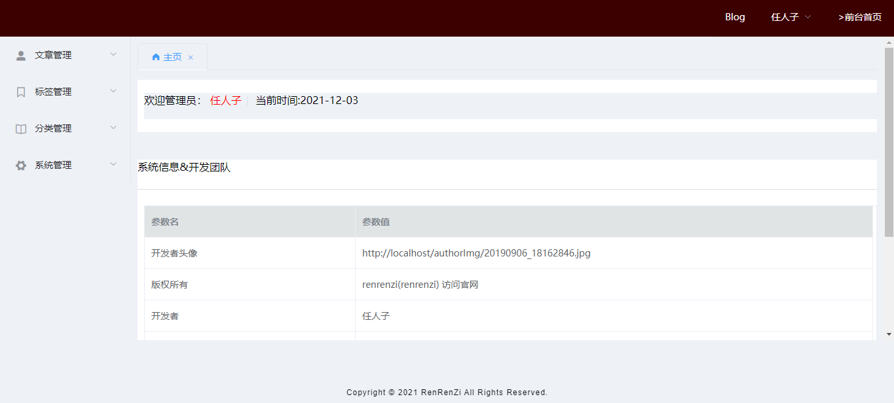
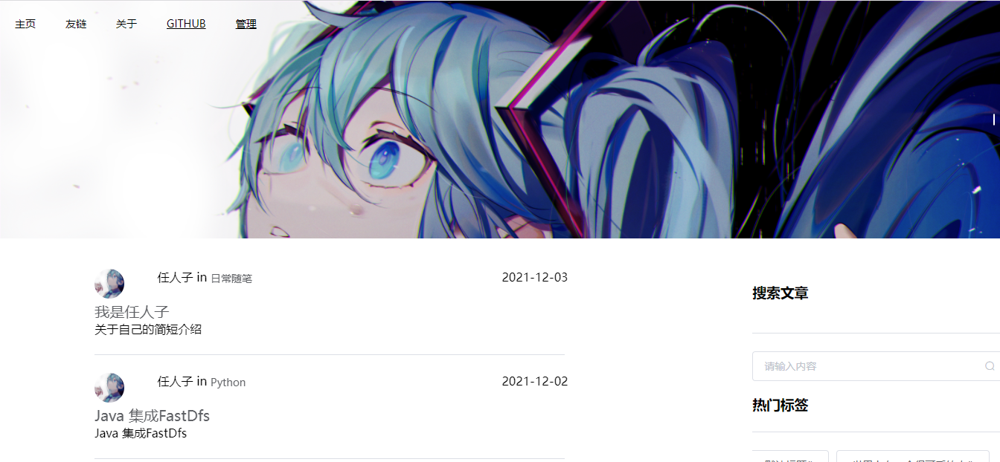

# J-Blog 个人博客系统
- 该项目基于原 My-Blog-LayUi 项目二次开发的 Spring Boot + vue 前后端分离项目，后台和博客的页面采用 vue + elementui 进行重构的；
- 作者前端技术薄弱，页面看看就行！
- 技术栈新颖且知识点丰富，学习后可以提升大家对于知识的理解和掌握；
- 页面预览 [J-Blog](http://renrenzi.top/)
- 管理员账号：admin 密码： 000000
# 使用说明
- 数据库文件
- 前端采用 vue + elementui
- 后端 Springboot + mybatis-plus,文件上传 fastDfs,登录权限验证(Sa-token), Redis 保存 游客点赞信息，定时任务刷新数据库。
- 有任何问题都可以反馈给我，我会尽量完善该项目。
# 效果预览
## 后台管理页面
- 登录页面

- 后台首页

- 文章编辑

- 评论管理

- 系统配置

## 前台展示页面
- 首页

- 文章浏览

- 友链

# 联系作者
> 大家有任何问题或者建议都可以在 [issues]中反馈，我会慢慢完善这个项目。
- 任人子的邮箱：[486084544@qq.com](486084544@qq.com)
