# J-Blog 个人博客系统
- 该项目基于原 My-Blog-LayUi 项目二次开发的 Spring Boot + Vue 前后端分离项目，
后台和博客的页面采用 Vue + ElementUI 进行重构的；
- 作者前端技术薄弱，页面看看就行！
- 技术栈新颖且知识点丰富，学习后可以提升大家对于知识的理解和掌握；
- 页面预览 [微极客](http://renrenzi.top/)
- [后台API文档](http://120.39.217.37:2235/doc.html) (云服务器带宽小，访问较慢)
- 管理员账号：admin 密码： 000000
# 技术说明
- 前端采用 vue + ElementUI。
- 后端 Springboot + Mybatis-Plus
文件上传 fastDfs,登录权限验证(Sa-token)。
- Redis 保存 游客点赞信息，定时任务刷新到数据库。
- 接口文档 knife4j, knife4j是为Java MVC框架集成Swagger生成Api文档的增强解决方案
- 有任何问题都可以反馈给我，我会尽量完善该项目。
# 效果预览
# 后台运行使用说明
> 首先下载并运行 blog.sql 文件
- [数据库文件](./sql/blog.sql)
> 修改 application.yml 文件
- 注意将此处改为 / ,否则将会启用 application-prod.yml 文件
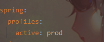
> 修改 Mysql 账号密码 

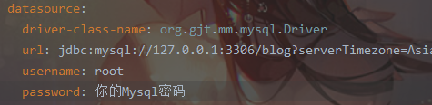
> 修改Redis 密码IP

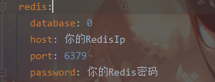
> 修改 fastdfs.conf

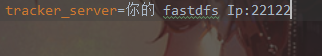
# 前端运行使用说明
> [跳转front查看README文件](./front/README.md)
## 后台管理页面
- 登录页面
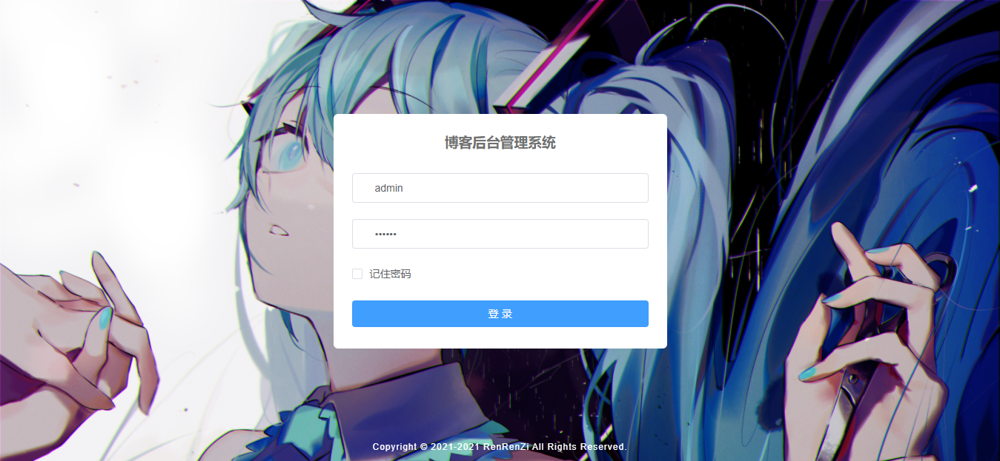
- 后台首页
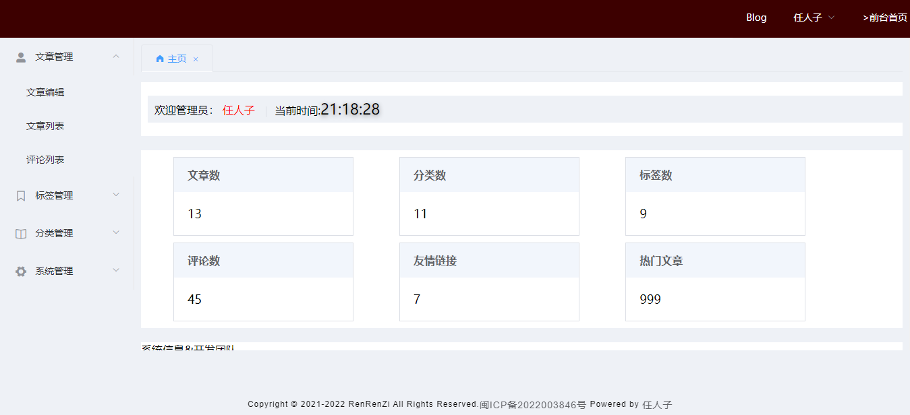
- 文章编辑
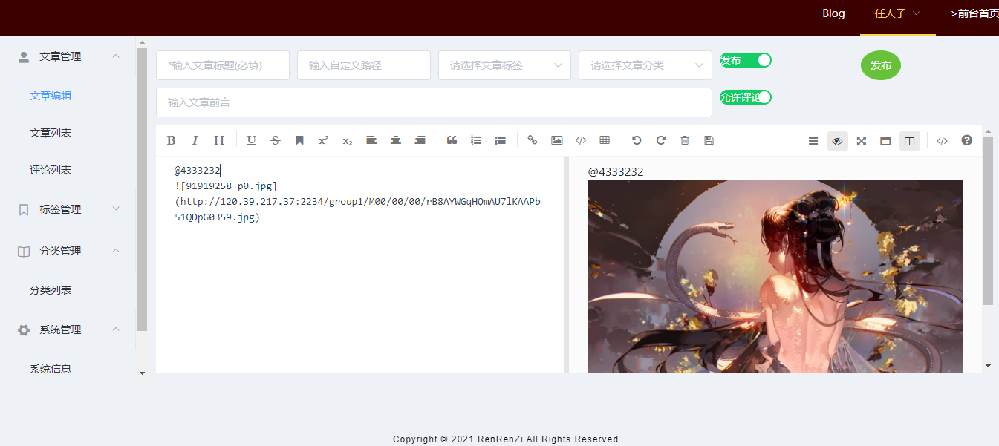
- 评论管理
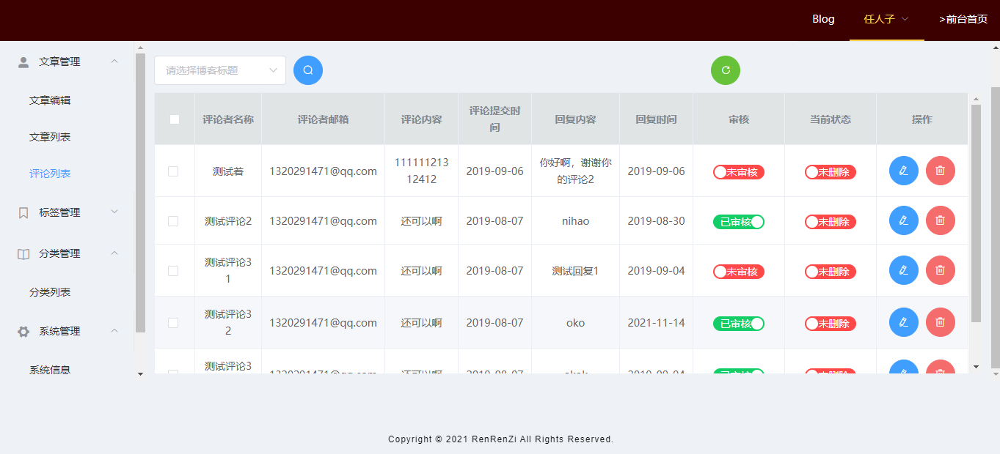
- 系统配置
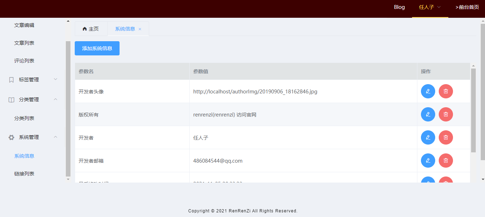
## 前台展示页面
- 首页
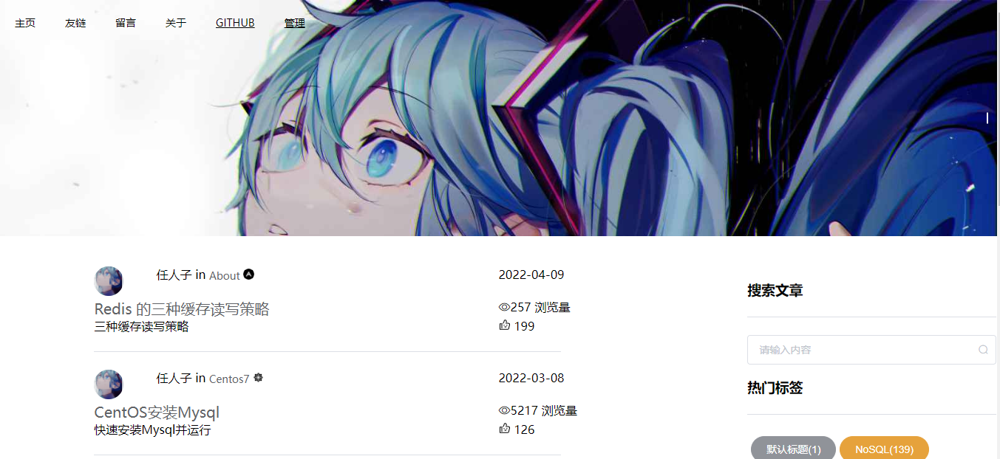
- 文章浏览
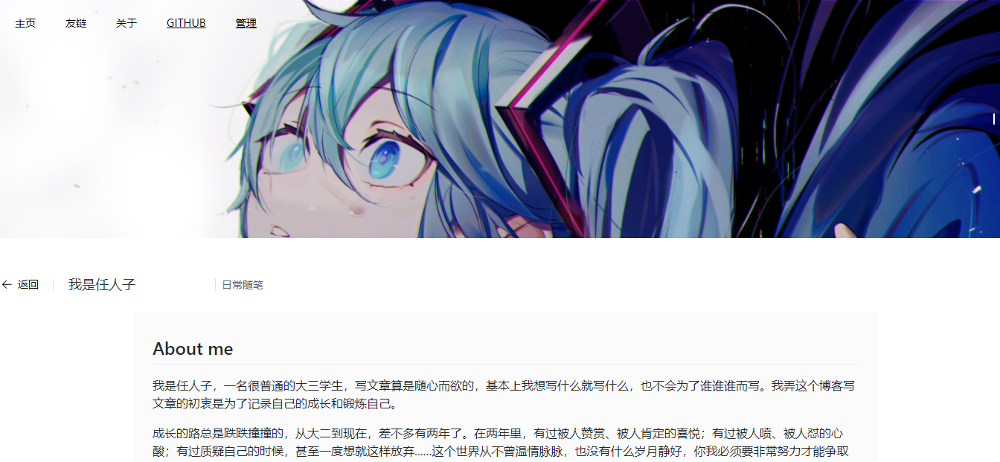
- 友链

- 留言
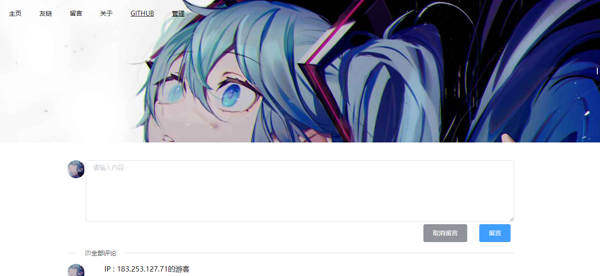
# 联系作者
> 大家有任何问题或者建议都可以在 [issues]中反馈，我会慢慢完善这个项目。
- 任人子的邮箱：[486084544@qq.com](http://wpa.qq.com/msgrd?v=3&uin=486084544&site=qq&menu=yes)
