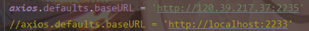

# admin-blogs

## Project setup
```
npm install
```
> 注意! 将 main.js 的 axios 请求地址改为你的本地后端地址
如下

### Compiles and hot-reloads for development
```
npm run serve
```


### Compiles and minifies for production
```
npm run build
```

### Customize configuration
See [Configuration Reference](https://cli.vuejs.org/config/).
